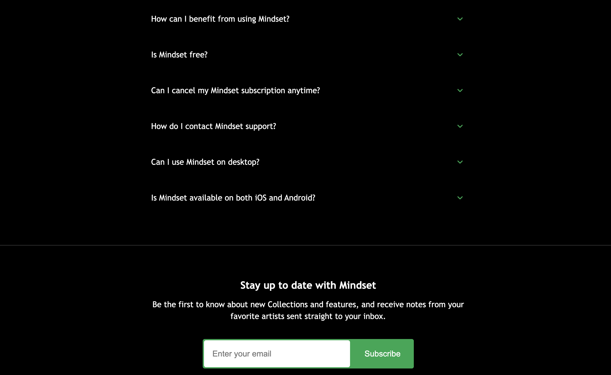
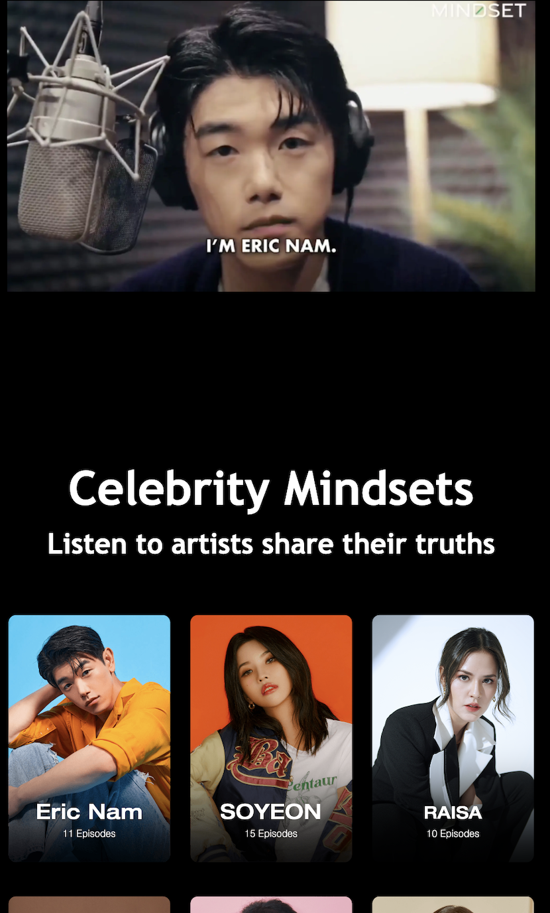

## Introduce the project

- This is a 2nd clone project of [Mindset](https://www.getmindset.com/) by [Dive Studios](https://www.divestudios.io/) at Tamwood College.
- Cloning a project allows you to learn from real-world examples, improve problem-solving skills, build a portfolio, and gain practical experience with new technologies efficiently.
- This is an updated version of the [daheeahn/clone-mindset](https://github.com/daheeahn/clone-mindset) project with responsive design added.
- Author: [daheeahn](https://github.com/daheeahn)

## What is Mindset

- Get Mindset is a platform that offers tools and resources to help individuals develop a growth mindset, improve mental resilience, and achieve personal and professional growth, featuring programs with celebrity mentors.

## Why I choose Mindset

- I chose this project because I am interested in K-pop, and it includes content led by K-pop celebrities. Additionally, the focus on mindset aligns with my belief in the importance of mental strength, which also influenced my decision.

## Core Focus

1. Implemented three different responsive versions for `desktop`, `tablet`, and `mobile` to handle various screen sizes. Common CSS is in `main.css.css`.
2. Optimized images and page sizes.
3. Utilized Transitions and Keyframe to create an animation for faq and fade-in when scrolling.

- You can find the CSS files in:
  - [`main.css`](https://github.com/daheeahn/clone-responsive-mindset/blob/main/css/main.css)
  - [`desktop.css`](https://github.com/daheeahn/clone-responsive-mindset/blob/main/css/desktop.css)
  - [`tablet.css`](https://github.com/daheeahn/clone-responsive-mindset/blob/main/css/tablet.css)
  - [`mobile.css`](https://github.com/daheeahn/clone-responsive-mindset/blob/main/css/mobile.css)
- The entire content can be found in the [📊Presentation](https://github.com/daheeahn/clone-responsive-mindset/blob/main/Presentation.pdf) file.

## Project Structure

```
CLONE-RESPONSIVE-MINDSET/
├── assets/                    # Folder for all static assets like images, icons, etc.
├── css/                       # Folder for CSS stylesheets.
│   ├── desktop.css            # CSS for desktop view.
│   ├── main.css               # Common styles shared across all views.
│   ├── mobile.css             # CSS for mobile view.
│   └── tablet.css             # CSS for tablet view.
├── .htaccess                  # Server configuration file (Apache-related settings).
├── 404.html                   # Custom 404 error page for 'Page Not Found'.
├── index.html                 # Main HTML file for the project.
├── Presentation.pdf           # PDF version of the presentation file.
└── README.md                  # Project description and documentation.
```

## Preview

- The Main page introduces the features of Mindset and below is preview

### Desktop, Tablet

<br/>
<br/>
<br/>
<br/>
<br/>
<br/>
<br/>
<br/>
<br/>
<br/>
<br/>
<br/>

### Mobile

<br/>
<br/>
<br/>
<br/>
<br/>
<br/>
<br/>
<br/>
<br/>
<br/>
<br/>
<br/>
<br/>
<br/>
<br/>
<br/>
